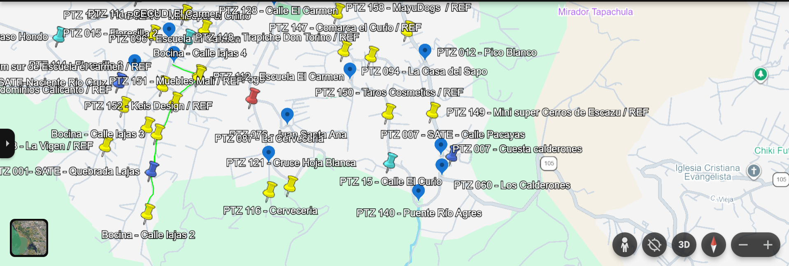
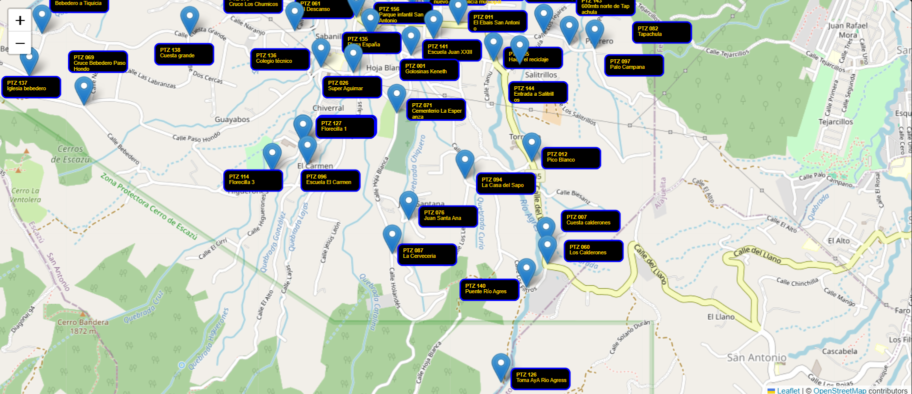

# KMZ to HTML Converter

A simple and efficient Python tool to convert **KMZ** files into fully interactive **HTML maps** that can be viewed directly in any web browser.

## Features
* **Auto-Decompression:** Automatically extracts the core KML data from the compressed KMZ archive.
* **Geospatial Parsing:** Extracts coordinate data, placemarks, and geometric points.
* **Interactive Output:** Generates a standalone, responsive HTML map using Folium

## Requirements & Installation

Make sure you have Python 3.x installed on your system. Install the required dependencies using pip:

```bash
pip install -r requirements.txt
```

## Usage

1. Clone this repository:
   ```bash
   git clone https://github.com
   ```
2. Place your `.kmz` file in the project directory.
3. Run the main script:
   ```bash
   python .\src\main.py
   ```
4. Open the generated `output\mapear.html` file in any web browser to view your map.

## Advantages

* **No Third-Party Software Required:** You don't need to open, process, or export your files through Google Earth, ArcGIS, or any other heavy GIS software. The conversion happens 100% locally and natively in Python.
* **Smart Text Positioning:** You can dynamically move and adjust the text labels of your data points. This prevents text overlapping and clutter, ensuring a much cleaner, professional, and readable map generation.

# Visual Improvement (Before vs. After)

By adjusting text labels dynamically, the script eliminates text overlapping, making complex maps much cleaner and easier to read.

| Before (Overlapped & Cluttered) | After (Clean & Readable) |
| :---: | :---: |
|  |  |

